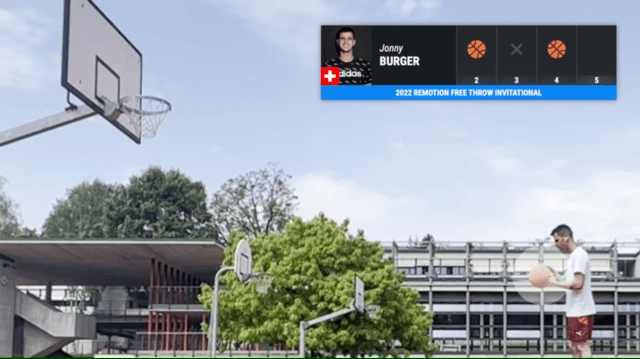

# React + Remotion basketball tracker



**See tutorial (8min)**: https://youtu.be/A8miHLSf_BI

Since this is a fun project, no issues / pull requests are accepted.

## Commands

**Install Dependencies**

```console
npm i
```

**Start Preview**

```console
npm start
```

**Render video**

```console
npm run build
```

**Upgrade Remotion**

```console
npm run upgrade
```

## Docs

Get started with Remotion by reading the [fundamentals page](https://www.remotion.dev/docs/the-fundamentals).

## Help

We provide help [on our Discord server](https://discord.gg/6VzzNDwUwV).

## Issues

Found an issue with Remotion? [File an issue here](https://github.com/remotion-dev/remotion/issues/new).

## License

Notice that for some entities a company license is needed. Read [the terms here](https://github.com/remotion-dev/remotion/blob/main/LICENSE.md).
